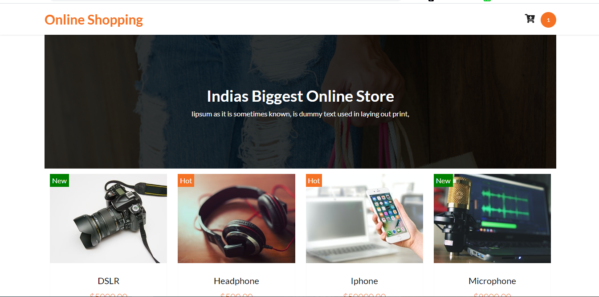

### Online Shopping Cart With React

### http://online-my-shop.surge.sh/

_**----- Pic Home page-----**_ 

_**----- Pic Cart Page-----**_ 

### How to Use this
1. 1st download this repo as zip
2. Unzip the file 
3. Go inside file and open CMD / git-bash
4. $npm install - It will install all necessary libraries
5. $npm run start - It will run your website in localhots  http://localhost:3000
6. $npm run build - it will create a build/dist folder that you can deploy online

### For free deployment By Surge
1. After $npm run build you type $npm intall --global surge
2. $surge login - it will ask you email and password
3. $surge dist/build - provide your folder name
4. then rename your domain then it will craete a link for you...
